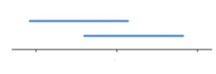
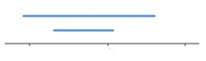
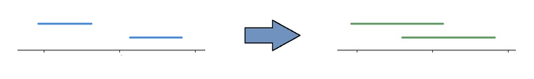

**提示：** 总共只允许至多做一次操作，这次操作可能带来怎样的影响呢？

考虑到总共只进行一次操作，我们将我们的答案理解为开始的差的绝对值之和，再加上调整一步这一绝对值之和如何变化即可。

我们相当于考虑 $(|a_i-b_j|+|a_j-b_i|)-(|a_i-b_i|+|a_j-b_j|)$ 这个数值如何取到最大。

我们当然可以直接讨论这四个数的大小关系，不过这略显麻烦。但绝对值给我们提供了另一个理解路径：数轴上的距离。

我们发现，对于数轴上四个点进行两两配对后的连线，两种方案得到的总线段长度都是一样的——

<center>





</center>

因此，唯一可能增大数值的方案就是选取两段完全没有重合的线段。我们发现，在这种情况下，无论怎么交换两条线段的其中一个节点，都能使得最后结果增加中间间隔部分的两倍长度。（可以自己手绘一下可能的情况，下面给出其中一种）

<center>



</center>

于是，我们要找到任两条线段之间的最大间隔，而这只需要我们找到线段的最大左端点和最小右端点即可。因此贪心即可完成。注意可以不进行任何操作。

时间复杂度为 $\mathcal{O}(n)$ .

#### 具体代码如下（只包含中间处理部分）——

```Python []
def main():
    n = II()
    nums1 = LII()
    nums2 = LII()
    for i in range(n):
        # 使得 nums1 保存左端点，nums2 保存右端点
        if nums1[i] > nums2[i]:
            nums1[i], nums2[i] = nums2[i], nums1[i]
    # 原答案的计算由于 nums1[i], nums2[i] 已经存在序关系，因此直接求和相减
    # 中间间隔计算与上述题解一致
    print(sum(nums2) - sum(nums1) + max(0, max(nums1) - min(nums2)) * 2)
    return 
```