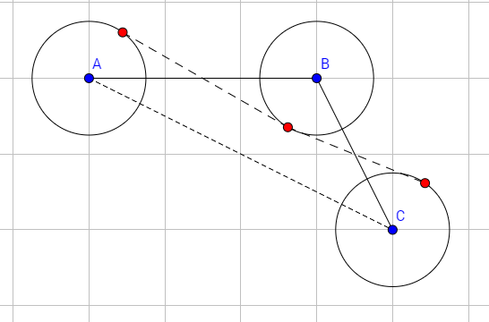

**提示 1：** 要我们找最大的 $d$ 使得顶点无论在半径为 $d$ 的圆内如何变动，图形都不凹。这相当于要我们找到最小的 $d$ ，使得图形变得不严格凸。

**提示 2：** 为了使得图形不严格凸，我们只需要考虑每一个角是否是凹的。

根据上述两个提示，我们考虑每一个角如何在最小的 $d$ 下变成不严格凸的。

这里，我们对角上的三个点分别画一个圆。接下来我们要在三个圆上分别取一点使其不严格凸，即要么共线，要么凹。

边界情况下，这三个圆有一条公切线。

具体而言，图如下——（还好这题 Codeforces 题解给了个不错的图）



于是，在图片的提示下，三个共线红点就是我们的最优选择。如果 $d$ 更小，那么一定使严格凸的。

那么我们怎么求出图中情况的 $d$ 呢？其实我们只需要求出 $B$ 到线段 $AC$ 的距离，再除以 $2$ 即可。

这个距离的求法很多，最简单的方法是求 $ΔABC$ 的面积除以线段 $AC$ 的长度再乘以 $2$ 。而 $ΔABC$ 的面积可以通过叉乘进行计算，即 $|\overrightarrow{BA}\times \overrightarrow{BC}|=|BA||BC|\sin B=2S_{ΔABC}$ . 叉乘相关知识可以自行查询。

我们枚举每一个角，求对应的 $d$ 的最小值即可。

时间复杂度为 $\mathcal{O}(n)$ .

#### 具体代码如下（只包含中间处理部分）——

```Python []
def main():
    n = II()
    xs = []
    ys = []
    for _ in range(n):
        x, y = MII()
        xs.append(x)
        ys.append(y)

    d = inf
    for i in range(-1, n - 1):
        dx1 = xs[i] - xs[i-1]
        dy1 = ys[i] - ys[i-1]
        dx2 = xs[i+1] - xs[i]
        dy2 = ys[i+1] - ys[i]
        dx = xs[i+1] - xs[i-1]
        dy = ys[i+1] - ys[i-1]
        d = min(d, abs(dx1 * dy2 - dy1 * dx2) / (dx * dx + dy * dy) ** 0.5)

    print(d / 2)
```