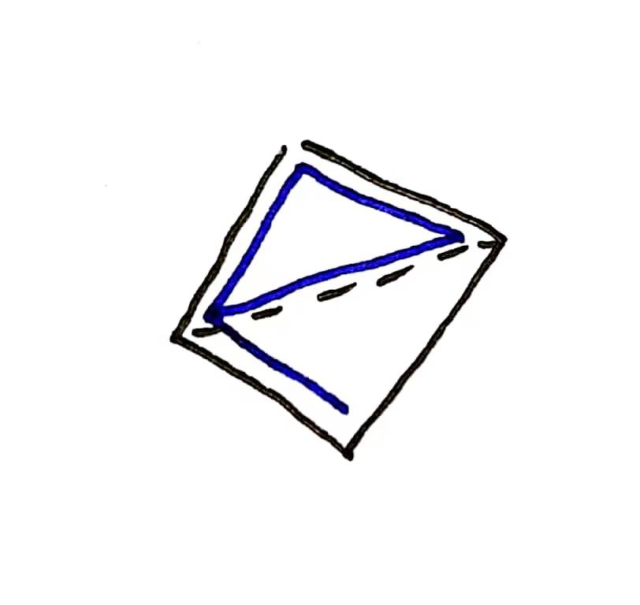

**提示 1：** 找到这种图的特殊点。

**提示 2：** 特殊点需要满足什么条件？

整个鱼形图中，最特殊的点显然就是中间那个环和边交界的点。

这个点首先度数不能小于 $4$，其次得有经过它的一个环。

而一旦有这一个环，我们总能找到对应的鱼形图。

我们假设我们已经找到了对应的一个环，那么这个点不在环上的边至少有两条。

考虑这两条边，如果有端点在环上，那么我们可以 **缩小原有的环** 。原有的环被分为两个小环，我们取其中一个，搭配另一个环中的一条边即可。

就如下图，黑色的边是原有的环，此时新增了虚线边，则我们考虑的环可以变成上面的蓝色的环，而用原有环的边作为环外的边。



就这样，我们总可以加入两条边，这样就可以构造出来一个鱼图了。

接下来我们只需要找到初始的环即可。这件事可以直接 DFS 实现。

时间复杂度为 $\mathcal{O}(nm)$ ，因为你需要枚举每一个度数不小于 $4$ 的点，看其能否构成一个环。

#### 具体代码如下（只包含中间处理部分）——

```Python []
def main():
    n, m = MII()
    
    path = [[] for _ in range(n)]
    for i in range(m):
        u, v = GMI()
        path[u].append(v)
        path[v].append(u)
    
    edges = []
    for i in range(n):
        if len(path[i]) >= 4:
            vis = [-1] * n
            parent = [-1] * n
            vis[i] = i
            
            # 这里是找环的另一个方式，先构造一棵 BFS 树
            # 再找中间的交叉的边
            # 此时找到的环一定不会发生前面新边端点在环上的问题
            dq = deque([j for j in path[i]])
            for u in dq:
                vis[u] = u
                parent[u] = i
            
            while dq:
                u = dq.popleft()
                for v in path[u]:
                    if vis[v] == -1:
                        vis[v] = vis[u]
                        parent[v] = u
                        dq.append(v)
            
            for u in range(n):
                for v in path[u]:
                    if u != i and v != i and vis[u] != -1 and vis[v] != -1 and vis[u] != vis[v]:
                        edges.append((u, v))
                        
                        while u != i:
                            vis[u] = -1
                            edges.append((u, parent[u]))
                            u = parent[u]
                        while v != i:
                            vis[v] = -1
                            edges.append((v, parent[v]))
                            v = parent[v]
                        
                        cnt = 0
                        for j in path[i]:
                            if vis[j] != -1:
                                cnt += 1
                                edges.append((i, j))
                                if cnt == 2: break
                        break
                if len(edges): break
            if len(edges): break
    
    if len(edges) == 0: outs.append('NO')
    else:
        outs.append('YES')
        outs.append(str(len(edges)))
        for u, v in edges:
            outs.append(f'{u + 1} {v + 1}')
```