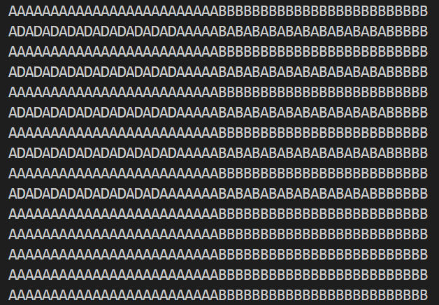

**提示 1：** 想办法，在不改变其他的连通块数量的时候，增加一个颜色的连通块数量。

**提示 2：** 注意，我们给出的区域可以很大（ $50\times 50$ ），因此每个颜色的区域也可以很大。在区域很大的情况下思考提示 1 。

脑筋急转弯、构造题。

因为对于所有不同的 $(a,b,c,d)$ 都需要完成构造，因此我们最好让我们的构造有一定的关系。我们考虑从 $(1,1,1,1)$ 出发，即均只有一个连通块出发，对于每个颜色，依次单独增加其连通块数量。

这就得到了我们的提示 1，我们想要在不改变其他连通块数量的情况下，增大某个颜色的连通块数量。

而我们的区域只需要不大于 $50\times 50$ ，而越大的区域能给我们越大的发挥空间，因此我们先拆成 $4$ 个 $25\times 25$ 的区域。

现在我们每个颜色都有个很大的区域了！

接下来我们要增加某个颜色的连通块数量，我们可以 **在其他颜色的区域里面点一个该颜色的点** ，且该位置周围的 $3\times 3$ 区域内均为原颜色，则不改变其他颜色的连通块数量。

下面是构造的一个局部。



这里，`'A'` 里藏了 `'D'` ，`'B'` 里藏了 `'A'`。我们把每个颜色藏到另一个颜色中间就行。

$25\times 25$ 的区域内，这样的位置有 $12\times 12=144$ 个，因此能构造出 $145$ 个连通块，远大于题目要求的 $50$ ，满足要求。因此根据上述逻辑可以给出构造。

#### 具体代码如下（只包含中间处理部分）——

```Python []
def main():
    nums = LII()

    print(50, 50)
    ans = [[''] * 50 for _ in range(50)]

    s = 'ABCD'

    for i in range(50):
        for j in range(50):
            ans[i][j] = s[(i >= 25) * 2 + (j >= 25)]

    for c in range(4):
        x, y = divmod((c + 1) % 4, 2)
        for i in range(1, 21, 2):
            for j in range(1, 21, 2):
                if nums[c] > 1:
                    ans[i + x * 25][j + y * 25] = s[c]
                    nums[c] -= 1

    print('\n'.join(''.join(x) for x in ans))
```
