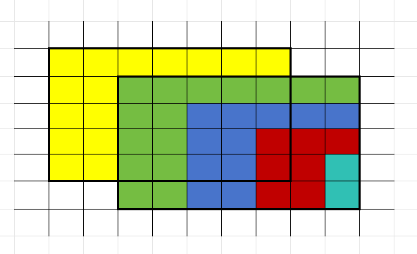

**提示 1：** 首先，不在矩形区域内的可以任意染色。

**提示 2：** 如果矩形区域完全重合 / 完全不重合，可以很轻松地分析。那如果两个矩形相交了呢？

根据提示，我们只讨论两个矩形相交的情况即可。

我们可以先填其中一个矩形，把其不被另一个矩形覆盖的区域全部染色。则根据两个矩形的染色情况完全一致，**我们可以直接得到矩形内所有位置的染色结果** 。

具体而言，我们可以看下面的这个图：



首先，我们先把左上角的矩形中不被右下角矩形覆盖的完全填满，就是黄色的部分。

而黄色的部分确定了，由于右下角矩形跟左上角完全一致，因此绿色部分需要跟黄色部分完全一致。

接下来，**看绿色部分被包含在左上角矩形的部分**，这一部分在右下角矩形中对应于蓝色部分，因此蓝色部分也确定了。

继续考虑蓝色部分在左上角矩形的部分，这一部分在右下角矩形中对应于红色部分，因此红色部分也确定了。

最后，红色部分在左上角矩形的部分可以确定右下角的青色区域，我们完成了整体染色。

因此，在这种情况下，我们相当于有一个矩形的区域是通过推理产生染色的，剩下可以任意染色。

总结起来，只有两个矩形重合的时候可以全盘面任意染色，否则总有一个矩形是通过推理决定染色的，因此其自由格子数量分别为 $n\times m$ 和 $n\times m-r\times c$ 。每个格子可以任意染 $k$ 色之一，直接使用快速幂计算即可。

时间复杂度为 $\mathcal{O}(\log nm)$ .

#### 具体代码如下（只包含中间处理部分）——

Python 版：

```Python []
def main():
    n, m, k, r, c = MII()
    ax, ay, bx, by = MII()
    mod = 10 ** 9 + 7
    print(pow(k, n * m - r * c * (ax != bx or ay != by), mod))
```

C++ 版：

```cpp []
signed main()
{
    int n, m, k, r, c, mod = 1e9+7;
    cin >> n >> m >> k >> r >> c;

    int ax, ay, bx, by;
    cin >> ax >> ay >> bx >> by;

    cout << quickPow(k, 1ll * n * m - ((ax == bx) && (ay == by) ? 0 : 1ll * r * c), mod) << '\n';

    return 0;
}
```