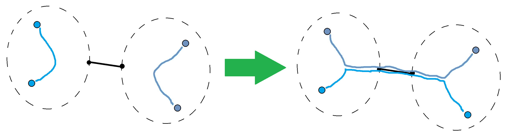
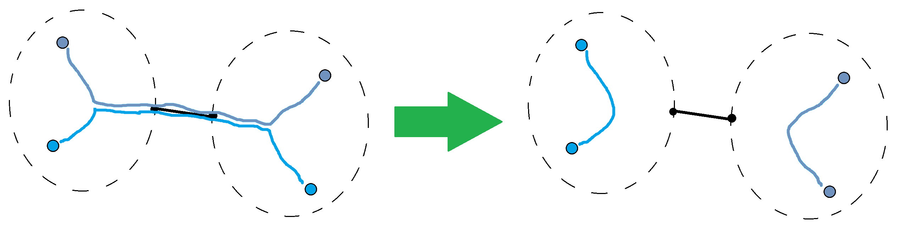

**提示 1：** 我们不可能单独考虑每一组匹配，因此按照点考虑是不显示的。考虑每条边对答案的贡献。

**提示 2：** 每条边的权重的最大值如何？最小值如何？一定能构造方案吗？这些都是完全理解求最值问题的重要步骤。

按照点的相互匹配解决问题是不现实的（可以使用贪心，但是比较麻烦），因为有太多的点需要匹配。更容易的方式是从边入手。

一条边最少算多少次呢？如果这条边砍掉了之后，两侧的连通块大小都是偶数，那么这条边可以永远不被使用，否则至少使用一次。

一条边最多算多少次呢？如果这条边砍掉了之后，两侧连通块大小分别是 $x,y$ ，则最多有 $\min(x,y)$ 条路径穿过这条边，这就是最大权重。

最后再想想，这件事能够取到吗？答案是肯定的， Codeforces 上的题解给了很不错的解释图：





两张图是什么意思呢？首先，通过一条边的路径数量的奇偶性是不会改变的。此时考虑其是否能任意增加 $2$ 或者减少 $2$ 。

在经过路径数量小于最大值时，至少比最大值小了 $2$ ，那么此时两侧一定都分别有一条路径不穿过中间的那条边，经过图 $1$ 的变换，可以使得总边权变大。

类似地，如果经过路径数量大于最小值时，至少比最小值大了 $2$ ，那么此时至少有两条路径穿过了中间的边，进行图 $2$ 的变化，可以使得总边权变小。

时间复杂度为 $\mathcal{O}(n)$ 。

### 具体代码如下——

Python 做法如下——

```Python []
def main():
    t = II()
    outs = []

    for _ in range(t):
        k = II()
        n = 2 * k
        
        us = []
        vs = []
        ws = []
        
        path = [[] for _ in range(n)]
        
        for i in range(n - 1):
            u, v, w = MII()
            u -= 1
            v -= 1
            
            us.append(u)
            vs.append(v)
            ws.append(w)
            path[u].append(i)
            path[v].append(i)
        
        parent = [-1] * n
        parent_weight = [0] * n
        order = []
        
        stk = [0]
        
        while stk:
            u = stk.pop()
            order.append(u)
            for i in path[u]:
                v = us[i] + vs[i] - u
                if parent[u] != v:
                    parent[v] = u
                    parent_weight[v] = ws[i]
                    stk.append(v)
        
        sz = [1] * n
        for u in reversed(order):
            if u > 0:
                sz[parent[u]] += sz[u]
        
        mi = ma = 0
        for i in range(n):
            mi += sz[i] % 2 * parent_weight[i]
            ma += fmin(n - sz[i], sz[i]) * parent_weight[i]
        
        outs.append(f'{mi} {ma}')

    print('\n'.join(outs))
```

C++ 做法如下——

```cpp []
signed main()
{
    ios_base::sync_with_stdio(false);
    cin.tie(0);
    cout.tie(0);

    int t;
    cin >> t;

    while (t --) {
        int n, k;
        cin >> k;
        n = k * 2;

        vector<vector<array<int, 2>>> path(n);
        for (int i = 0; i < n - 1; i ++) {
            int u, v, w;
            cin >> u >> v >> w;
            u --, v --;

            path[u].push_back({v, w});
            path[v].push_back({u, w});
        }

        long long mi = 0, ma = 0;

        auto dfs = [&] (auto &self, int u, int p, int w) -> int {
            int sz = 1;
            for (auto &v: path[u]) {
                if (v[0] != p) {
                    sz += self(self, v[0], u, v[1]);
                }
            }
            mi += (sz & 1 ? w : 0);
            ma += 1ll * min(n - sz, sz) * w;
            return sz;
        };

        dfs(dfs, 0, -1, 0);
        cout << mi << ' ' << ma << '\n';
    }

    return 0;
}
```