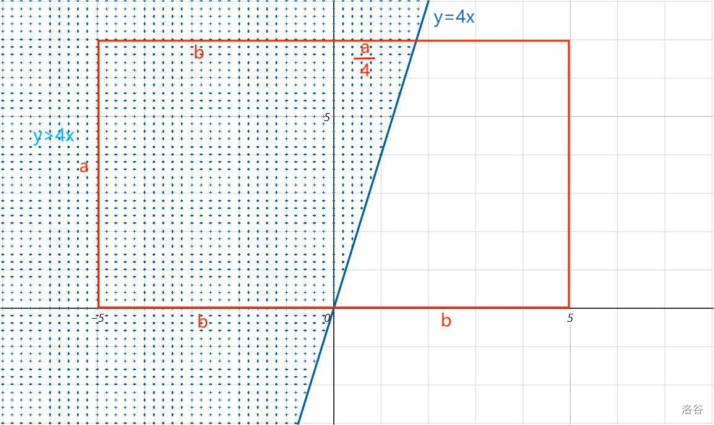
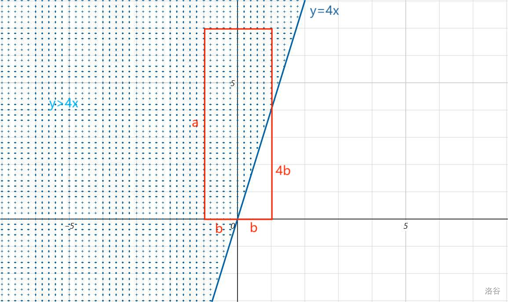

**提示 1：** 先把二次方程有解的条件列出来。

**提示 2：** 在坐标系上画出可能的 $(p,q)$ 位置，再标记所有满足条件的 $(p,q)$ 位置，就能算概率了。

**提示 3：** 什么时候全集并不对应于一个区域呢？此时答案如何？

根据二次方程判别式（也可以手动配方），可以得到： $p-4q\geq 0$ 。

即可以有 $p\geq 4q$ 。

而如果我们在平面直角坐标系上画出 $[0,a]\times [-b,b]$ 表示可行的 $(p,q)$ ，则一般对应于一个矩形。而其中可行的部分是 $p\geq 4q$ 的部分。

于是我们只需计算这部分的面积，这取决于右上角的点和 $p=4q$ 这条直线的位置关系。因此有两种情况。

给出洛谷题解里的两张图，大概长这样：

在 $a\leq 4b$ 时，对应区域如下——



落到左侧满足条件的概率为 $\frac{1}{2}$ ，落到右侧满足条件的概率为 $\frac{a\times a/4\times 1/2}{2ab}=\frac{a}{16b}$ ，于是总概率等于 $\frac{1}{2}+\frac{a}{16b}$ 。

在 $a\gt 4b$ 时，对应区域如下——



我们可以用总概率减去不在区域内的概率，即 $1-\frac{b\times 4b\times 1/2}{2ab}=1-frac{b}{a}$ 。

如果你停留到此处你的代码将出现 RUNTIME ERROR 一类的错误（实际上来源于除以 $0$ ）。事实上，这是因为刚刚的分析基于面积，而在区间长度为 $1$ 时，面积应当等于 $0$ 。所以我们需要进一步处理 $a$ 或 $b$ 等于 $0$ 的情况。

$b=0$ 时，总有解 $x=0$ ，有实数解的概率是 $1$ 。

否则， $b$ 为正， $a=0$ ，此时 $b$ 非正和正数的概率都是 $\frac{1}{2}$ ，而只有非正的情况下能有实数解，因此输出 $\frac{1}{2}$ 。

注意这里如果先考虑 $a=0$ ，则 $a=0,b=0$ 的情况还需要特判，因为此时并不满足： $b$ 非正和正数的概率都是 $\frac{1}{2}$ 。

于是我们讨论完了所有情况，时间复杂度为 $\mathcal{O}(1)$ 。

### 具体代码如下——

Python 做法如下——

```Python []
def main():
    t = II()
    outs = []

    for _ in range(t):
        a, b = MII()
        if b == 0: outs.append(1)
        elif a == 0: outs.append(0.5)
        elif a < 4 * b: outs.append(0.5 + a / 16 / b)
        else: outs.append(1 - b / a)

    print('\n'.join(map(str, outs)))
```

C++ 做法如下——

```cpp []
int main() {
    ios_base::sync_with_stdio(false);
    cin.tie(0);
    cout.tie(0);

    int t;
    cin >> t;

    cout << fixed << setprecision(10);
    while (t --) {
        int a, b;
        cin >> a >> b;
        if (b == 0) cout << 1 << '\n';
        else if (a == 0) cout << 0.5 << '\n';
        else if (a < 4 * b) cout << 0.5 + 1.0 * a / 16 / b << '\n';
        else cout << 1 - 1.0 * b / a << '\n';
    }

    return 0;
}
```
