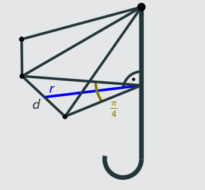

**提示 1：** 找一个直角三角形就好。

首先，如果雨伞可以平摊开，这显然是面积最大化的情况。此时面积等于 $8$ 个等腰三角形的面积，即 $8\times\frac{1}{2}x^2\sin\frac{\pi}{4}$ ，因此只要布料不小于它时，输出它就行。

否则，用的布料越多越好，所以我们可以先确定每个伞面上的等腰三角形的各个信息，现在关键在于算投影的面积。为此我们需要得到投影的三角形的某个信息。

官方题解的图画的不错，复制一下——



我们发现原三角形和投影三角形中最重要的共享信息就是底边 $d$ ，所以我们先计算得到 $d$ 。而底面的等腰三角形顶角是 $\frac{\pi}{4}$ ，所以可以借此得到这个三角形的各个信息，进而确定面积，乘 $8$ 就是结果。

时间复杂度显然是 $\mathcal{O}(1)$ 。

### 具体代码如下——

Python 做法如下——

```Python []
def main(): 
    a, b = map(float, input().split())
    
    v = 4 * b * b * math.sin(math.pi / 4)
    
    if a >= v: print(v)
    else:
        theta = math.asin(a / 4 / b / b) / 2
        w = b * math.sin(theta)
        print(w * w / math.tan(math.pi / 8) * 8)
```

C++ 做法如下——

```cpp []
int main() {
	ios_base::sync_with_stdio(false);
	cin.tie(0);
	cout.tie(0);

	long double a, b, pi = acosl(-1);
	cin >> a >> b;

	long double v = 4 * b * b * sinl(pi / 4);

	cout << fixed << setprecision(15);
	if (a >= v) cout << v;
	else {
		long double theta = asinl(a / 4 / b / b) / 2;
		long double w = b * sinl(theta);
		cout << w * w / tanl(pi / 8) * 8;
	}

	return 0;
}
```
