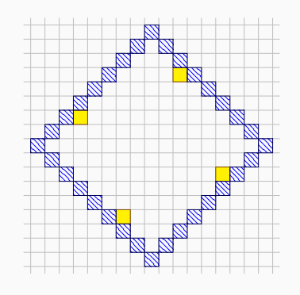
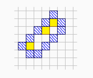

**提示 1：** 沿着外侧的墙走，相邻两个满足的条件是什么？可以用这个给出答案的一个界。

**提示 2：** 特殊情况。

因为最特殊的走法就是走对角线，对角线是 $x+y,x-y$ 来回最快的路径，所以考虑 $x+y,x-y$ 的事儿。

每次的步按照 $x+y,x-y$ 两个方向进行拆解，走的总步数是 $2$ ，而整体要从 $x+y$ 的最大值 $+1$ 走到最小值 $-1$ 再走回来， $x-y$ 也是一样的，因此总步数是两个极差的和的 $2$ 倍 $+8$ ，所以答案不小于极差的和 $+4$ 。

对于一般的情况，只需在外侧构造一个斜着的矩形就满足要求了。类似于这样：



但有特殊情况，如果这个矩形的宽是 $1$ ，内部元素就可能不连通了，此时需要多走一步留空间，类似于这样：



除此之外， $n=1$ 不能归为这种情况，需要特判。

时间复杂度为 $\mathcal{O}(n)$ 。

### 具体代码如下——

Python 做法如下——

```Python []
def main(): 
    n = II()
    inf = 10 ** 9
    
    add_ma = -inf
    add_mi = inf
    minus_ma = -inf
    minus_mi = inf
    
    for _ in range(n):
        x, y = MII()
        add_ma = fmax(add_ma, x + y)
        add_mi = fmin(add_mi, x + y)
        minus_ma = fmax(minus_ma, x - y)
        minus_mi = fmin(minus_mi, x - y)
    
    if add_ma == add_mi and minus_ma == minus_mi:
        print(4)
    elif add_ma == add_mi or minus_ma == minus_mi:
        print(add_ma - add_mi + minus_ma - minus_mi + 5)
    else:
        print(add_ma - add_mi + minus_ma - minus_mi + 4)
```

C++ 做法如下——

```cpp []
int main() {
	ios_base::sync_with_stdio(false);
	cin.tie(0);
	cout.tie(0);

	int n, inf = 1e9;
	cin >> n;

	int add_ma = -inf, add_mi = inf, minus_ma = -inf, minus_mi = inf;

	while (n --) {
		int x, y;
		cin >> x >> y;
		add_ma = max(add_ma, x + y);
		add_mi = min(add_mi, x + y);
		minus_ma = max(minus_ma, x - y);
		minus_mi = min(minus_mi, x - y);
	}

	if (add_ma == add_mi && minus_ma == minus_mi) cout << 4;
	else if (add_ma == add_mi || minus_ma == minus_mi)
		cout << add_ma - add_mi + minus_ma - minus_mi + 5;
	else cout << add_ma - add_mi + minus_ma - minus_mi + 4;

	return 0;
}
```
