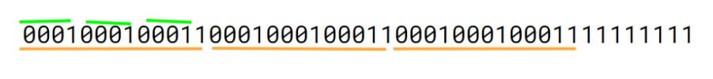

**提示 1：** 借助较小的 $k$ 找下规律。

我们令 $k=2/3$ 可以找到一些规律。

发现字符串的形式大概是这样的：

先是 $k$ 个 $0$ 一个 $1$ ，称这种结构是 $A_1$ 。

接下来看前缀，实际上是 $k$ 个 $A_1$ ，此时后面可以新增一个 $1$ ，这样就产生了新的结构，称为 $A_2$ 。

依次类推，直到最后出现了 $k$ 个 $1$ ，此后就只有 $1$ 了。



于是我们可以预处理前面的每种结构以及每种结构的 $1$ 的个数。多出来的部分都是 $1$ ，前面的部分可以从大到小分为一块一块的，每块的结果相加即可，具体可见代码。

时间复杂度为 $\mathcal{O}(\log M)$ 。

### 具体代码如下——

Python 做法如下——

```Python []
def main(): 
    n, k = MII()
    vals = [k + 1]
    cnt = [1]
    
    while vals[-1] < n and len(vals) < k:
        vals.append(vals[-1] * k + 1)
        cnt.append(cnt[-1] * k + 1)
    
    ans = fmax(n - vals[-1], 0)
    n -= ans
    
    for i in range(len(vals) - 1, -1, -1):
        x, n = divmod(n, vals[i])
        ans += x * cnt[i]
    
    print(ans)
```

C++ 做法如下——

```cpp []
int main() {
	ios_base::sync_with_stdio(false);
	cin.tie(0);
	cout.tie(0);

	int n, k;
	cin >> n >> k;

	vector<long long> vals = {k + 1}, cnt = {1};

	while (vals.back() < n && vals.size() < k) {
		vals.emplace_back(vals.back() * k + 1);
		cnt.emplace_back(cnt.back() * k + 1);
	}

	int ans = max(n - vals.back(), 0ll);
	n -= ans;

	for (int i = vals.size() - 1; i >= 0; i --) {
		ans += n / vals[i] * cnt[i];
		n %= vals[i];
	}

	cout << ans;

	return 0;
}
```
