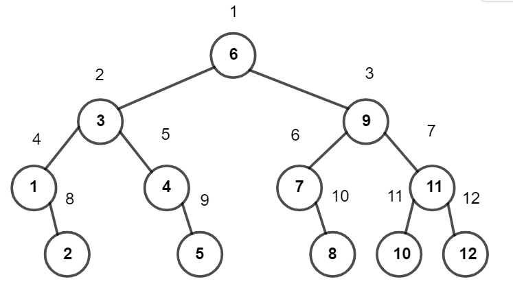

**提示 1：** 可以画图表示下整个搜索的过程。

整体的搜索过程是一个二叉树的东西，可以看这里：



前面几层都是满的，对应的遍历顺序也是很容易相互确定的，即两倍父节点 / 两倍父节点 + 1，走左右子树也可以通过模拟二分得到。

那最后一层的答案怎么办呢？我们可以先假设最后一层是满的，得到一个结果。接下来我们相当于要去掉最后一层被多算的节点数量。（就是 $k$ 前面需要补充多少结点才能是满的二叉树）

这件事怎么算呢？模拟一个子树是满的的情况，看对应结点的编号是多少，跟 $k$ 作差即可。

时间复杂度为 $\mathcal{O}(\log M)$ 。

### 具体代码如下——

Python 做法如下——

```Python []
def main(): 
    t = II()
    outs = []
    
    for _ in range(t):
        n, idx = MII()
        ans = -1
        
        l, r = 1, n
        cur = 1
        last_cnt = 0
        cnt = 1
        
        while cnt <= n:
            mid = (l + r) // 2
            
            if idx >= mid: last_cnt = last_cnt * 2 + 1
            else: last_cnt = last_cnt * 2
            
            if idx == mid:
                ans = cur
                break
            
            if idx < mid:
                r = mid - 1
                cur = cur * 2
            else:
                l = mid + 1
                cur = cur * 2 + 1
            
            cnt = cnt * 2 + 1
        
        if ans == -1:
            ans = idx + cnt // 2 - last_cnt
        
        outs.append(ans)
    
    print(' '.join(map(str, outs)))
```

C++ 做法如下——

```cpp []
int main() {
	ios_base::sync_with_stdio(false);
	cin.tie(0);
	cout.tie(0);

	int t;
	cin >> t;

	while (t --) {
		long long n, idx;
		cin >> n >> idx;

		long long ans = -1;

		long long l = 1, r = n, cur = 1, last_cnt = 0, cnt = 1;
		while (cnt <= n) {
			long long mid = l + (r - l) / 2;
			if (idx >= mid) last_cnt = last_cnt * 2 + 1;
			else last_cnt = last_cnt * 2;

			if (idx == mid) {
				ans = cur;
				break;
			}

			if (idx < mid) {
				r = mid - 1;
				cur = cur * 2;
			}
			else {
				l = mid + 1;
				cur = cur * 2 + 1;
			}

			cnt = cnt * 2 + 1;
		}

		if (ans == -1)
			ans = idx + cnt / 2 - last_cnt;

		cout << ans << ' ';
	}

	return 0;
}
```

