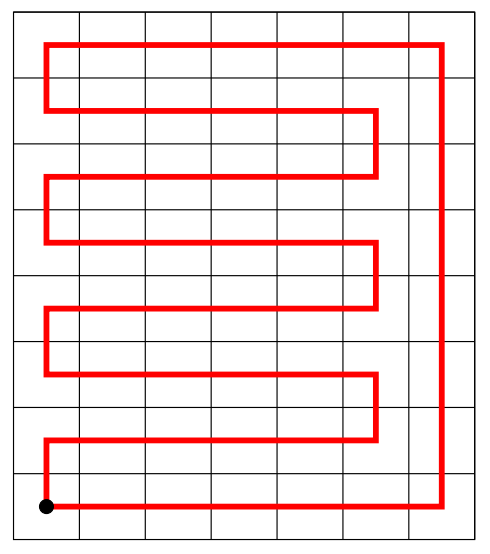

**提示 1：** 考虑每次操作的格子满足什么性质。

**提示 2：** 借此找到必要条件。能证明吗？

首先整个图肯定只能由偶数个格子，不然的话两个两个操作肯定操作不完。

每次操作的格子相邻，因此对应的 $x+y$ 的奇偶性一定不相同。

所以我们可以黑白间隔染色，每次操作用的黑色和白色的格子数量一样，因此总用的黑色格子和白色格子也一样。所以挖掉的两个洞也得满足一黑一白，因为整个盘面的黑色格子和白色格子一样多。

这个条件够了吗？答案是一般够了。我们可以用一个环遍历整个图形中的每个格子。挖了两个洞之后，两个洞之间的段长度都是偶数，也就可以分割成很多个 $2$ 元的操作了。



特殊情况呢？就是找不到这样一个环。发现 $n=1$ 或 $m=1$ 的情况下不行。此时只需判断下分割的三段是否长度都是偶数就行。

时间复杂度为 $\mathcal{O}(1)$ 。

### 具体代码如下——

Python 做法如下——

```Python []
def main(): 
    t = II()
    outs = []
    
    for _ in range(t):
        n, m, r1, c1, r2, c2 = MII()
        
        if n % 2 and m % 2: outs.append('NO')
        elif fmin(n, m) == 1:
            if m == 1:
                n, m = m, n
                r1, c1 = c1, r1
                r2, c2 = c2, r2
            if c1 > c2: c1, c2 = c2, c1
            if (c1 - 1) % 2 or (c2 - c1 - 1) % 2 or (m - c2) % 2:
                outs.append('NO')
            else:
                outs.append('YES')
        elif (r1 + c1) % 2 == (r2 + c2) % 2: outs.append('NO')
        else: outs.append('YES')
    
    print('\n'.join(map(str, outs)))
```

C++ 做法如下——

```cpp []
int main() {
	ios_base::sync_with_stdio(false);
	cin.tie(0);
	cout.tie(0);

	int t;
	cin >> t;

	while (t --) {
		int n, m, x1, y1, x2, y2;
		cin >> n >> m >> x1 >> y1 >> x2 >> y2;

		if ((n * m) & 1) cout << "NO\n";
		else if (min(n, m) == 1) {
			if (m == 1) {
				swap(n, m);
				swap(x1, y1);
				swap(x2, y2);
			}
			if (y1 > y2) swap(y1, y2);

			cout << ((y1 - 1) % 2 == 0 && (y2 - y1 - 1) % 2 == 0 && (m - y2) % 2 == 0 ? "YES\n" : "NO\n");
		}
		else cout << (((x1 + y1 + x2 + y2) & 1) ? "YES\n" : "NO\n");
	}

	return 0;
}
```
