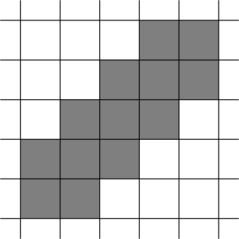

**提示 1：** 考虑下被计数的灰色的格子，我们相当于肯定要包围它们，同时不产生新的被包围的格子。那么这些格子应该怎么安排？注意还得是偶数个邻居。

先看提示 1 。

最容易的想法就是排成一条线，这样就不会产生新的被计数的灰色格子了。

但这样还有偶数邻居的条件没有满足。发现这条线如果横着排好像难以达到目标，但是斜着排，中间的格子就都满足要求了，两侧只要加两个格子也满足要求了，我们就完成了构造。



时间复杂度为 $\mathcal{O}(n)$ 。

### 具体代码如下——

Python 做法如下——

```Python []
def main(): 
    n = II()
    print(3 * n + 4)
    
    for i in range(-1, n):
        print(i, i)
        print(i, i + 1)
        print(i + 1, i)
    
    print(n, n)
```

C++ 做法如下——

```cpp []
int main() {
	ios_base::sync_with_stdio(false);
	cin.tie(0);
	cout.tie(0);

	int n;
	cin >> n;

	cout << 3 * n + 4 << '\n';

	for (int i = -1; i < n; i ++) {
		cout << i << ' ' << i << '\n';
		cout << i << ' ' << i + 1 << '\n';
		cout << i + 1 << ' ' << i << '\n';
	}

	cout << n << ' ' << n << '\n';

	return 0;
}
```
