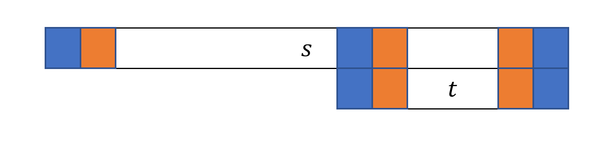

**提示 1：** 我们只需看有多少个位置可以删前缀，多少个位置可以删后缀，再把这两个结果组合。

**提示 2：** 前缀操作可以不断分解。

先看提示 1 。如果我们知道所有可以删去的前缀的长度和所有可以删去的后缀的长度，则只要两者删去的总长小于 $n$ ，就可以造出合法的字符串。这个问题是很明显可以线性解决的，可以使用双指针，前缀和等多种方式。

接下来看可以删掉的前缀长度怎么求。

事实上，所有可以达到的前缀长度都可以通过 “不断删去最短的回文偶数长度前缀” 得到。

为什么呢？假设我们第一步删的不是最短的回文偶数长度前缀。设最短的是 $T$ ，而我们删了 $T'$ 。

则 $T$ 是 $T'$ 的前缀且回文，因此也是后缀。（可以证明回文前缀等价于存在对应的后缀，利用类似下图的逻辑推就行）



如果前后缀有重合部分，则重合部分是回文的， $T$ 内包含了回文后缀，因此也有回文前缀，与 $T$ 最短矛盾。

而如果两倍 $T$ 长度不超过 $T'$ ，则可以将 $T'$ 拆成 $T+S+T$ 三个回文串。也就是说第一步可以删最短的回文偶数长度前缀。

综上，我们可以不断删去最短的回文前缀得到所有可删的前缀。

而找最短回文前缀可以使用 Manacher 。我们先计算 Manacher 数组，再顺序遍历所有的偶数回文串的中心位置，看能否到达还没删去的最靠前的位置，如果可以，就贪心删去对应的偶数长度回文前缀，依次类推。整体只是遍历一遍，复杂度线性。

后缀情况也类似。直接反转字符串可以用同一段代码解决。

时间复杂度为 $\mathcal{O}(n)$ 。

### 具体代码如下——

Python 做法如下——

```Python []
def main(): 
    def possible_positions(s):
        tmp = '*'.join(s)
        manacher = [0] * (2 * n - 1)
        idx = 0
        
        for i in range(1, 2 * n - 1):
            if idx + manacher[idx] >= i:
                manacher[i] = fmin(idx + manacher[idx] - i, manacher[2 * idx - i])
            while i - manacher[i] - 1 >= 0 and i + manacher[i] + 1 < 2 * n - 1 and tmp[i - manacher[i] - 1] == tmp[i + manacher[i] + 1]:
                manacher[i] += 1
            if i + manacher[i] > idx + manacher[idx]:
                idx = i
        
        ans = [0] * (n + 1)
        ans[0] = 1
        to_fill = 0
        
        for i in range(1, 2 * n - 1, 2):
            if i > to_fill and i - manacher[i] <= to_fill:
                ans[(2 * i - to_fill) // 2 + 1] = 1
                to_fill = 2 * i - to_fill + 2
        
        return ans
    
    s = I()
    n = len(s)
    
    pre = possible_positions(s)
    suf = possible_positions(s[::-1])
    suf.reverse()
    
    ans = 0
    cur = 0
    
    for i in range(n):
        cur += pre[i]
        ans += cur * suf[i + 1]
    
    print(ans)
```

C++ 做法如下——

```cpp []
int main() {
	ios_base::sync_with_stdio(false);
	cin.tie(0);
	cout.tie(0);

	string s;
	cin >> s;

	int n = s.size();

	auto possible_positions = [&] (string s) -> vector<int> {
		string tmp;
		for (int i = 0; i < n; i ++) {
			if (i) tmp += '*';
			tmp += s[i];
		}

		vector<int> manacher(2 * n - 1, 0);
		int idx = 0;

		for (int i = 1; i < 2 * n - 1; i ++) {
			if (idx + manacher[idx] > i)
				manacher[i] = min(idx + manacher[idx] - i, manacher[2 * idx - i]);
			while (i - manacher[i] - 1 >= 0 && i + manacher[i] + 1 < 2 * n - 1 && tmp[i - manacher[i] - 1] == tmp[i + manacher[i] + 1])
				manacher[i] ++;
			if (i + manacher[i] > idx + manacher[idx]) idx = i;
		}

		vector<int> ans(n + 1, 0);
		ans[0] = 1;

		int to_fill = 0;

		for (int i = 1; i < 2 * n - 1; i += 2) {
			if (i > to_fill && i - manacher[i] <= to_fill) {
				ans[(2 * i - to_fill) / 2 + 1] = 1;
				to_fill = 2 * i - to_fill + 2;
			}
		}

		return ans;
	};

	auto pre = possible_positions(s);
	reverse(s.begin(), s.end());
	auto suf = possible_positions(s);
	reverse(suf.begin(), suf.end());

	long long ans = 0;
	int cur = 0;

	for (int i = 0; i < n; i ++) {
		cur += pre[i];
		ans += cur * suf[i + 1];
	}

	cout << ans;

	return 0;
}
```
