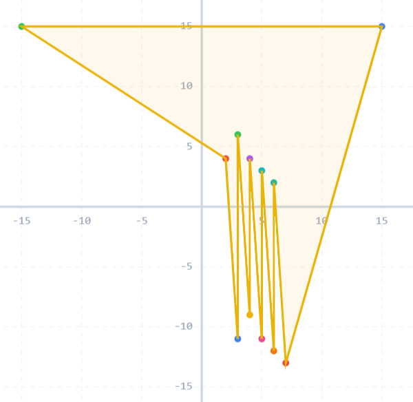

**提示 1：** 考虑较难构造的情况。

我们考虑一些比较难构造的情况。

比方说一个 $k\times k$ 的格点方阵，应该怎么连起来呢？

一种思路是，我们把格点两行两行配对，然后用锯齿状连上它们。如果有一行落单了就新增一行。最后把这些锯齿连起来，外层再包围起来。

另一种方式，前面我们发现了锯齿形很有用，但可能涉及到前一行的事儿，所以很麻烦。我们可以选择在上一行的极右侧新建若干个点，这样折线就可以用它们。类似于这样（用非常靠边的位置来凑）：



时间复杂度为 $\mathcal{O}(n)$ 。

### 具体代码如下——

Python 做法如下——

```Python []
def main():
    t = II()
    outs = []
    
    step = 2 * 10 ** 8 + 5
    
    for _ in range(t):
        n = II()
        pts = []
        
        for _ in range(n):
            x, y = MII()
            pts.append((x, y))
        
        pts.sort()
        
        ans = []
        
        for x, y in pts:
            ans.append(f'{x} {y}')
            ans.append(f'{x + 1} {y - step}')
        
        ans.append(f'{step} {step}')
        ans.append(f'{-step} {step}')
        
        outs.append(str(len(ans)))
        outs.append('\n'.join(ans))
    
    print('\n'.join(outs))
```

C++ 做法如下——

```cpp []
int main() {
	ios_base::sync_with_stdio(false);
	cin.tie(0);
	cout.tie(0);

	int t, step = 2e8 + 5;
	cin >> t;

	while (t --) {
		int n;
		cin >> n;

		vector<pair<int, int>> pts(n);
		for (auto &[x, y]: pts) cin >> x >> y;

		sort(pts.begin(), pts.end());

		cout << n * 2 + 2 << '\n';
		for (auto &[x, y]: pts) {
			cout << x << ' ' << y << '\n';
			cout << x + 1 << ' ' << y - step << '\n';
		}
		cout << step << ' ' << step << '\n';
		cout << -step << ' ' << step << '\n';
	}

	return 0;
}
```
