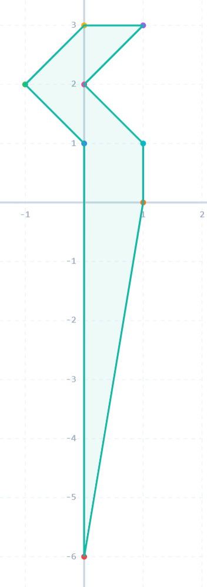
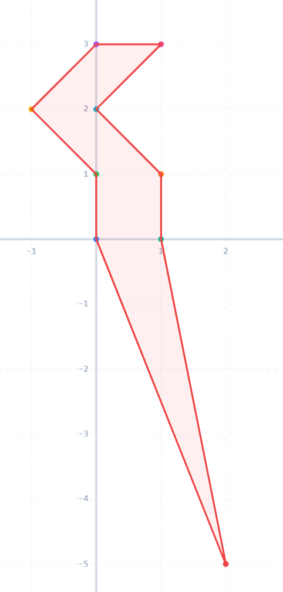

**提示 1：** 找到 $n$ 个点面积的最小图形。

**提示 2：** 基于此调整。

首先，根据皮克定理，格点多边形面积等于边缘点数 / 2 + 内部点数 - 1，所以面积至少为 $n / 2 - 1$ ，如果面积更小，直接返回不合法即可。

这个能构造吗？答案是肯定的，你只需要不停拼接底是平的，高是 $1$ 的斜平行四边形就行了，这些可以拼接。

最后在这个基础上延申一个三角形凑面积即可。

这里是偶数的凑法：



这里是奇数的凑法：



时间复杂度为 $\mathcal{O}(n)$ 。

### 具体代码如下——

Python 做法如下——

```Python []
def main():
    t = II()
    outs = []
    
    for _ in range(t):
        n, A = MII()
        
        if 2 * A < n - 2: outs.append('No')
        else:
            outs.append('Yes')
            
            line0 = [(0, -2 * A + n - 2)] if n % 2 == 0 else [(2, -2 * A + n - 3), (0, 0)]
            line1 = [(1, 0)]
            
            for i in range(1, n // 2):
                line0.append((i % 2 - 1, i))
                line1.append((i % 2, i))
            
            line0.extend(reversed(line1))
            
            outs.append('\n'.join(f'{x} {y}' for x, y in line0))
    
    print('\n'.join(outs))
```

C++ 做法如下——

```cpp []
int main() {
	ios_base::sync_with_stdio(false);
	cin.tie(0);
	cout.tie(0);

	int t;
	cin >> t;

	while (t --) {
		int n, A;
		cin >> n >> A;
		if (2 * A < n - 2) cout << "No\n";
		else {
			cout << "Yes\n";

			if (n % 2 == 0) {
				cout << 0 << ' ' << -2 * A + n - 2 << '\n';
			}
			else {
				cout << 2 << ' ' << -2 * A + n - 3 << '\n';
				cout << 0 << ' ' << 0 << '\n';
			}

			for (int i = 1; i < n / 2; i ++) {
				cout << i % 2 - 1 << ' ' << i << '\n';
			}

			for (int i = n / 2 - 1; i > 0; i --) {
				cout << i % 2 << ' ' << i << '\n';
			}

			cout << 1 << ' ' << 0 << '\n';
		}
	}

	return 0;
}
```
