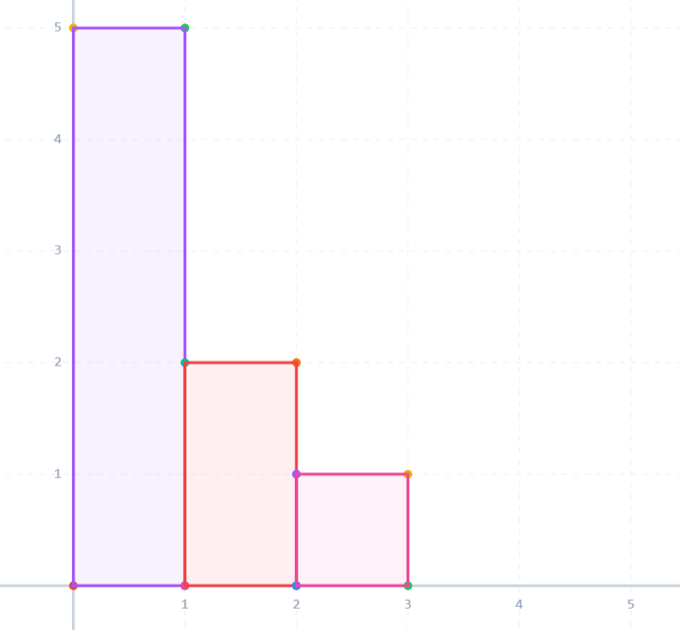
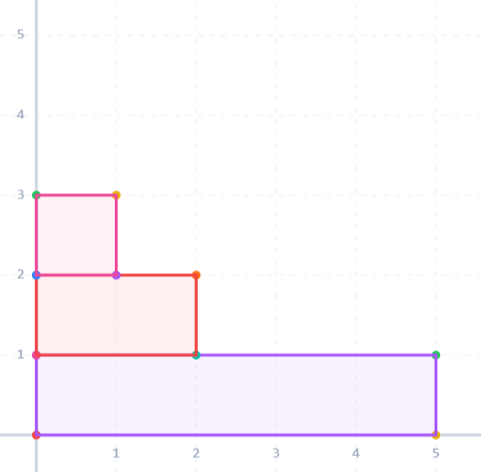

**提示 1：** 把整个图画成一个柱形图，最后要求是啥？

**提示 2：** 根据要求去掉元素。

在一个充分大的网格图中，第 $i$ 列从底部填入 $a_i$ 个元素。整个图形的左下角为原点。

这样我们最后的要求实际上是这个图形关于 $y=x$ 对称。

所以直接将整个图形关于 $y=x$ 对称，重合的部分就是最多能留下来的元素。

而要维护翻转后的图形，开始的一列变成一行，行的更新可以用差分数组来做，所以问题解决。类似于这个翻转：





求重合的部分就是剩余的最大部分。

时间复杂度为 $\mathcal{O}(n)$ 。

### 具体代码如下——

Python 做法如下——

```Python []
def main():
    t = II()
    outs = []
    
    for _ in range(t):
        n = II()
        nums = LII()
        diff = [0] * (n + 1)
        
        for x in nums:
            diff[0] += 1
            diff[fmin(n, x)] -= 1
        
        for i in range(n):
            diff[i + 1] += diff[i]
        
        outs.append(sum(nums) - sum(fmin(nums[i], diff[i]) for i in range(n)))
    
    print('\n'.join(map(str, outs)))
```

C++ 做法如下——

```cpp []
int main() {
	ios_base::sync_with_stdio(false);
	cin.tie(0);
	cout.tie(0);

	int t;
	cin >> t;

	while (t --) {
		int n;
		cin >> n;

		vector<int> nums(n), diff(n + 1, 0);
		for (auto &x: nums) {
			cin >> x;
			diff[0] ++;
			diff[min(n, x)] --;
		}

		for (int i = 1; i <= n; i ++) diff[i] += diff[i - 1];

		long long ans = 0;
		for (int i = 0; i < n; i ++) {
			ans += nums[i] - min(nums[i], diff[i]);
		}

		cout << ans << '\n';
	}

	return 0;
}
```
