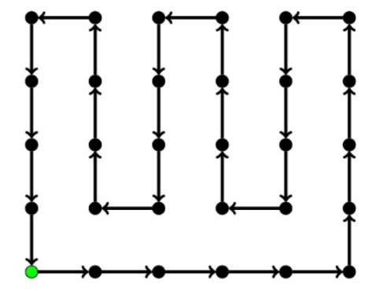
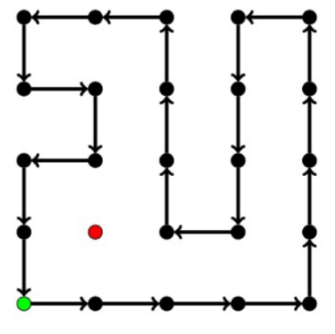

**提示 1：** 质因数分解后，相当于要在高维空间里尽可能遍历每一个点。

**提示 2：** 答案上界很好确定。怎么构造？

首先将 $n$ 进行质因数分解，得到 $n=\prod\limits_{i} p_i^{a_i}$ 。

每个数唯一对应于一个质因子的次数组合，我们每次相当于对次数中的某一项加一 / 减一，让最后回到初始位置。

首先，如果只有一个质因子，显然只能用 $1,p$ 之类的形成二元环。

否则，考虑两个质因子的情况。这就相当于一个矩形点阵，我要用一个环尽可能遍历所有的点。

容易发现，其中一边是偶数的情况下很容易构造遍历所有位置的一个环（偶数方便了你来回走）。否则能构造出一个只差一个点没遍历到的方案。





所以一旦有一个质因子次数是奇数次（这个维度就有 $0,1,\dots,a$ 这些选择，总共有 $a+1$ 种，是偶数），我们将这个质因子和另一个质因子组合，就可以得到所有这两个质因子形成的数的一个环。设为 $[x_1,x_2,\dots, x_k]$ 。此时如果还有别的质因子 $p^a$ ，我们可以构造 $[x_1,x_1p,\dots,x_1p^a,x_2p^a,\dots,x_2p,x_2,\dots]$ ，这样可以不断新增新的质因子。

如果所有质因子次数都是偶数，则总因子个数是奇数，无论如何必须有至少一个点走不到。我们还是先构造二维的情况。接下来，新增 $p^a$ 的情况下，我们还是采用前面的类似方法。

但是，这会使得缺的那个数 $x_0$ 以及其 $p,p^2,\dots,p^a$ 倍还没走到。不妨设 $x_0$ 的左侧点为 $x_1$ ，则在 $x_1p,x_1p^2$ 之间，我们可以插入 $x_0p,x_0p^2$，这样形成了 $x_1p,x_0p,x_0p^2,x_1p^2$ ，就解决掉了 $x_0p,x_0p^2$ 的问题。类似地，可以解决 $x_0p^{2k-1},x_0 p^{2k}$ ，只需在某一组 $x_1p^{2k-1},x_1p^{2k}$ 之间插入即可。这样不断插入两个元素，最后只剩下一个没有遍历到的元素。

综上，平方数情况下的总因子个数减一长度的环是可构造的。

时间复杂度为 $\mathcal{O}(\sqrt{n})$ 。

### 具体代码如下——

Python 做法如下——

```Python []
def main():
    n = II()
    d = Counter()
    
    for i in range(2, 100000):
        while n % i == 0:
            n //= i
            d[i] += 1
        
        if i * i > n: break
    
    if n > 1: d[n] += 1
    
    items = list(d.items())
    items.sort(key=lambda x: (x[1] + 1) % 2)
    
    if len(items) == 1:
        print(2)
        print(1, items[0][0])
    else:
        if items[0][1] % 2:
            x1, y1 = items[0]
            x2, y2 = items[1]
            
            ans = [1, x2]
            for i in range(y1 + 1):
                for j in range(y2 - 1):
                    if i % 2 == 0: ans.append(ans[-1] * x2)
                    else: ans.append(ans[-1] // x2)
                if i < y1:
                    ans.append(ans[-1] * x1)
            
            ans.append(ans[-1] // x2)
            
            for i in range(y1 - 1):
                ans.append(ans[-1] // x1)
            
            for i in range(2, len(items)):
                x, y = items[i]
                
                nans = []
                
                for j in range(len(ans)):
                    tmp = [ans[j]]
                    for _ in range(y):
                        tmp.append(tmp[-1] * x)
                    
                    if j % 2:
                        tmp.reverse()
    
                    nans.extend(tmp)
                
                ans = nans
            
            print(len(ans))
            print(' '.join(map(str, ans)))
        
        else:
            x1, y1 = items[0]
            x2, y2 = items[1]
            
            ans = [x2]
            
            for _ in range(y1 // 2):
                ans.append(ans[-1] * x1)
                ans.append(ans[-1] // x2)
                ans.append(ans[-1] * x1)
                ans.append(ans[-1] * x2)
            
            ans.append(ans[-1] * x2)
            
            for _ in range(y2 // 2 - 1):
                
                for _ in range(y1 - 1):
                    ans.append(ans[-1] // x1)
                
                ans.append(ans[-1] * x2)
                
                for _ in range(y1 - 1):
                    ans.append(ans[-1] * x1)
                
                ans.append(ans[-1] * x2)
            
            for _ in range(y1):
                ans.append(ans[-1] // x1)
            
            for _ in range(y2 - 2):
                ans.append(ans[-1] // x2)
            
            for i in range(2, len(items)):
                x, y = items[i]
                
                nans = []
                
                for j in range(len(ans)):
                    tmp = [ans[j]]
                    
                    for idx in range(y):
                        tmp.append(tmp[-1] * x)
                        
                        if j == 0:
                            if idx % 2 == 0:
                                tmp.append(tmp[-1] // x2)
                            else:
                                tmp.append(tmp[-1] * x2)
                    
                    if j % 2: tmp.reverse()
                    nans.extend(tmp)
                
                ans = nans
            
            print(len(ans))
            print(' '.join(map(str, ans)))
```

C++ 做法如下——

```cpp []
int main() {
	ios_base::sync_with_stdio(false);
	cin.tie(0);
	cout.tie(0);

	int n;
	cin >> n;

	map<int, int> mp;

	for (int i = 2; i <= 100000; i ++) {
		while (n % i == 0) {
			mp[i] ++;
			n /= i;
		}
		if (i * i > n) break;
	}

	if (n > 1) mp[n] ++;

	vector<pair<int, int>> items;
	for (auto &[x, y]: mp) items.emplace_back(x, y);

	sort(items.begin(), items.end(), [&] (pair<int, int> x, pair<int, int> y) {return x.second % 2 > y.second % 2;});

	if (items.size() == 1) {
		cout << 2 << '\n';
		cout << 1 << ' ' << items[0].first << '\n';
	}
	else {
		if (items[0].second & 1) {
			auto [x1, y1] = items[0];
			auto [x2, y2] = items[1];

			vector<int> ans = {1, x2};

			for (int i = 0; i <= y1; i ++) {
				for (int j = 0; j < y2 - 1; j ++) {
					if (i & 1) ans.emplace_back(ans.back() / x2);
					else ans.emplace_back(ans.back() * x2);
				}
				if (i < y1) ans.emplace_back(ans.back() * x1);
			}

			ans.emplace_back(ans.back() / x2);

			for (int i = 0; i < y1 - 1; i ++) ans.emplace_back(ans.back() / x1);

			for (int i = 2; i < items.size(); i ++) {
				auto [x, y] = items[i];
				vector<int> nans;

				for (int j = 0; j < ans.size(); j ++) {
					vector<int> tmp = {ans[j]};
					for (int k = 0; k < y; k ++) tmp.emplace_back(tmp.back() * x);

					if (j & 1) reverse(tmp.begin(), tmp.end());
					for (auto &v: tmp) nans.emplace_back(v);
				}

				ans.swap(nans);
			}

			cout << ans.size() << '\n';
			for (int i = 0; i < ans.size(); i ++)
				cout << ans[i] << " \n"[i + 1 == ans.size()];
		}
		else {
			auto [x1, y1] = items[0];
			auto [x2, y2] = items[1];

			vector<int> ans = {x2};

			for (int i = 0; i < y1 / 2; i ++) {
				ans.emplace_back(ans.back() * x1);
				ans.emplace_back(ans.back() / x2);
				ans.emplace_back(ans.back() * x1);
				ans.emplace_back(ans.back() * x2);
			}

			ans.emplace_back(ans.back() * x2);

			for (int i = 0; i < y2 / 2 - 1; i ++) {
				for (int j = 0; j < y1 - 1; j ++)
					ans.emplace_back(ans.back() / x1);
				ans.emplace_back(ans.back() * x2);
				for (int j = 0; j < y1 - 1; j ++)
					ans.emplace_back(ans.back() * x1);
				ans.emplace_back(ans.back() * x2);
			}

			for (int i = 0; i < y1; i ++) ans.emplace_back(ans.back() / x1);
			for (int i = 0; i < y2 - 2; i ++) ans.emplace_back(ans.back() / x2);

			for (int i = 2; i < items.size(); i ++) {
				auto [x, y] = items[i];
				vector<int> nans;

				for (int j = 0; j < ans.size(); j ++) {
					vector<int> tmp = {ans[j]};

					for (int idx = 0; idx < y; idx ++) {
						tmp.emplace_back(tmp.back() * x);

						if (!j) {
							if (idx & 1) tmp.emplace_back(tmp.back() * x2);
							else tmp.emplace_back(tmp.back() / x2);
						}
					}

					if (j & 1) reverse(tmp.begin(), tmp.end());
					for (auto &x: tmp) nans.emplace_back(x);
				}

				ans.swap(nans);
			}

			cout << ans.size() << '\n';
			for (int i = 0; i < ans.size(); i ++)
				cout << ans[i] << " \n"[i + 1 == ans.size()];
		}
	}

	return 0;
}
```
