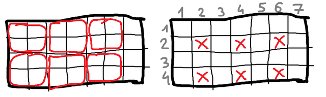

**提示 1：** 考虑 Alice 最多能覆盖多少格子。就能判断是否能赢了。



考虑图中的打叉的格子。

每次 Alice 必然恰好覆盖其中之一。而 Bob 最多可以覆盖一个叉。

设格子总数是 $x$ ，则 Alice 最多能覆盖 $\lceil x/2\rceil$ 个叉格（如果 Bob 每次选择叉格）。

而每次覆盖一个叉， Alice 总覆盖格子数是 $4$ 个。于是 Alice 最多覆盖 $4\lceil x/2\rceil$ 个格子。而 Bob 通过占领叉格，可以把 Alice 的各自数量控制到这个数量以下。

于是只需求解 $x$ 并计算上述数值，剩余格子就是 Bob 的。

分类讨论可以发现只跟 $n$ 关于 $4$ 的取模结果有关。

时间复杂度为 $\mathcal{O}(1)$ 。

### 具体代码如下——

Python 做法如下——

```Python []
def main():
    t = II()
    outs = []
    
    for _ in range(t):
        n = II()
        if n % 4 == 0: outs.append('Draw')
        elif n % 4 == 2: outs.append('Alice')
        else: outs.append('Bob')
    
    print('\n'.join(outs))
```

C++ 做法如下——

```cpp []
int main() {
	ios_base::sync_with_stdio(false);
	cin.tie(0);
	cout.tie(0);

	int t;
	cin >> t;

	while (t --) {
		int n;
		cin >> n;

		if (n & 1) cout << "Bob\n";
		else if (n % 4 == 0) cout << "Draw\n";
		else cout << "Alice\n";
	}

	return 0;
}
```